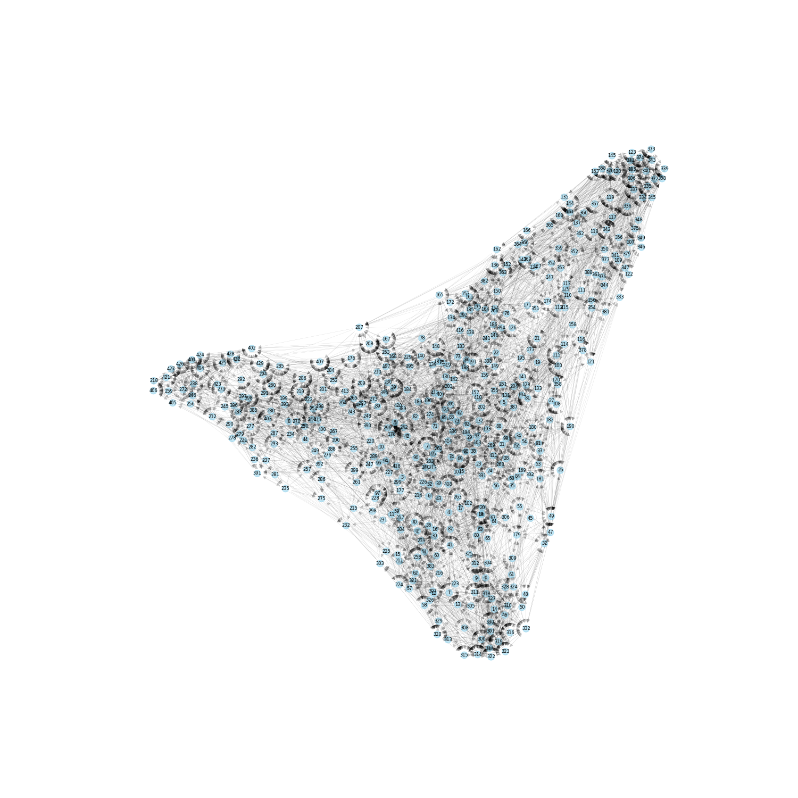
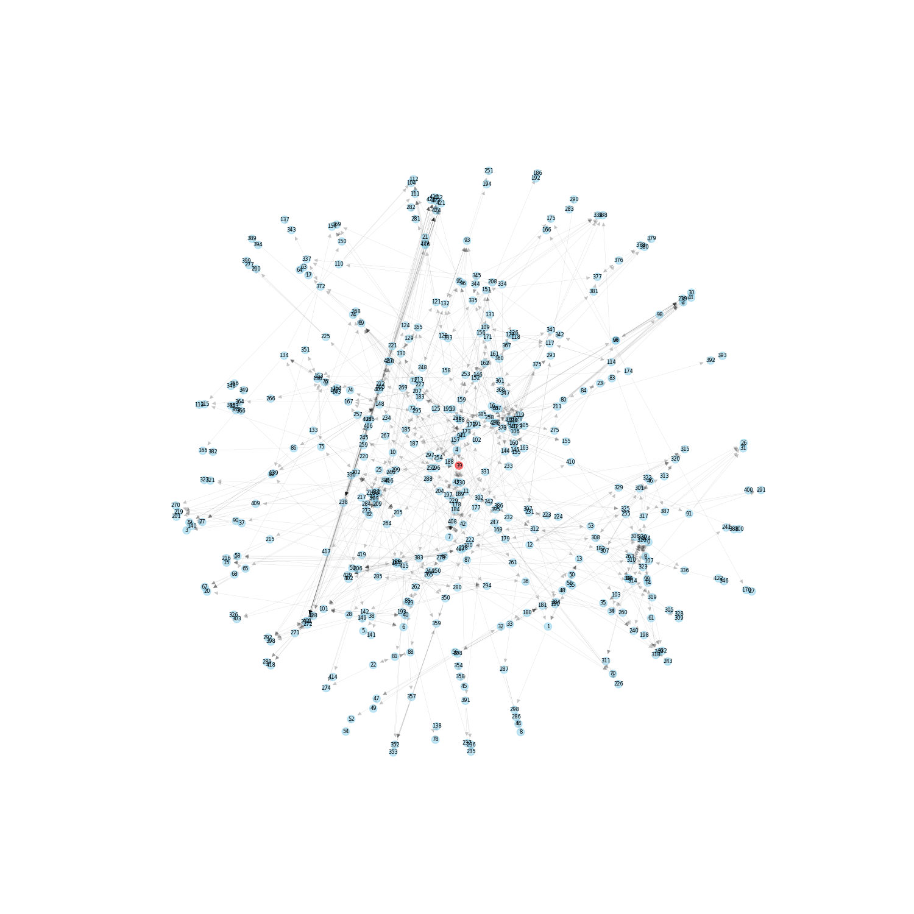

# Fast Approximate Nearest Neighbor Search With The Navigating Spreading-out Graph

Reference :[Fast Approximate Nearest Neighbor Search With TheNavigating Spreading-out Graph](https://arxiv.org/pdf/1707.00143)

# Introduction

In reference, the author proposes a new graph structure called the Monotonic Relative Neighborhood Graph (MRNG), which guarantees a low average search time complexity. The author also introduces the Navigating Spreading-out Graph (NSG), which serves as an effective approximation of MRNG.

The NSG offers several advantages:

- low out-degree
- shorter search paths
- low construction time
- comprehensive theoretical analysis

# Monotonic Relative Neighborhood Graph

The paper proposes a new graph structure—the **Monotonic Relative Neighborhood Graph** (MRNG)—which is not only a minimal MSNET but also a sparse graph. The MRNG utilizes a novel selection strategy.

- $lunepq = B(p, δ(p, q)) ∩ B(q, δ(p, q))$
- **Definition 5 (MRNG):**  Given a finite point set S of n point in space $E^d$ , an MRNG is a directed graph with the set of edges statisfying the following property : for any edge $\overrightarrow {pq}$ , $\overrightarrow {pq} \in MRNG$ if and only if $lune_{pq} \cap S =  ∅$ or  $∀r ∈ (lunepq ∩ S), \overrightarrow {pr} \notin MRNG.$

**Definition 5** presents an alternative selection strategy. 

---

# Construct The Navigating Spreading-out Graph

Although MRNG guarantees fast search times, it has a high construction time. The author proposes an approximation of MRNG called the "Navigating Spreading-out Graph" (NSG). We will now present the algorithm for constructing NSG:

1. We build an approximate $kNN$ graph using the method of "**K-Nearest-Neighbor-Graph**".
2. We find the center of the dataset through two steps: (1) Calculate the centroid of the dataset, and (2) Treat this centroid as a query, searching on the $kNN$ graph with Algorithm 1. This gives us the nearest node to the center as the navigating node.
3. We select edges for each node from neighbor candidates. For each node $p$, we treat it as a query and perform Algorithm 1, starting from the navigating node on the $kNN$ graph. During the search, each visited node $q$ is combined with $p's$ neighbors as a candidate set. Finally, we apply the $MRNG$ selection strategy to filter the edges for each $p$.
4. In the final step, we examine the connectivity of $NSG$. We span a $DFS$ tree on $NSG$ to verify full connectivity. If we find any isolated nodes, we add an edge between the node and its nearest neighbor using Algorithm 1. We repeat this process until the graph achieves full connectivity.

# Visualization

KNNG

NSG

